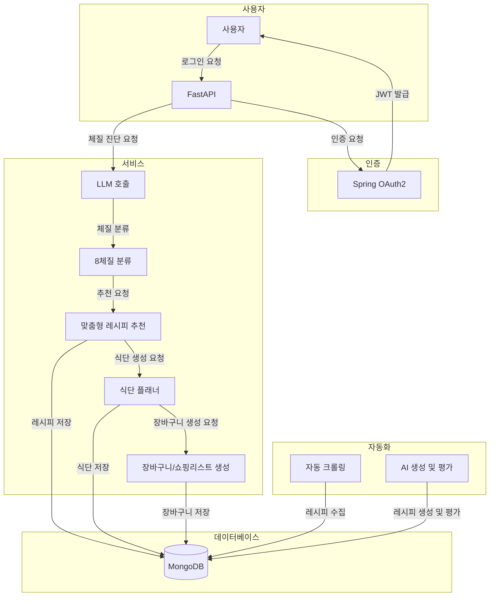

# 체질 기반 레시피 추천 플랫폼

## 프로젝트 개요
이 프로젝트는 사용자의 체질(한의학 기반)을 진단하고, 해당 체질에 최적화된 레시피를 자동으로 생성하여 개인화된 식단 관리 및 쇼핑을 지원하는 통합 플랫폼입니다.

## 주요 기능
- **체질 진단 챗봇**: LLM을 활용하여 사용자의 체질을 8가지 유형으로 분류합니다.
- **맞춤형 레시피 추천**: 체질, 선호 식재료, 알러지, 이력을 기반으로 개인화된 레시피를 추천합니다.
- **식단 플래너 & 캘린더 연동**: 자동으로 식단을 생성하고 외부 캘린더와 연동합니다.
- **장바구니/쇼핑리스트 자동 생성**: 추천된 레시피를 기반으로 필요한 재료를 자동으로 추출합니다.
- **레시피 생성 시스템**: RAG 및 MCP를 활용하여 사용자 맞춤형 레시피를 생성합니다.
- **자동 레시피 수집·생성 시스템**: 외부 사이트에서 레시피를 크롤링하고, AI를 통해 생성 및 평가합니다.

## 서비스 파이프라인

1. **로그인 & 인증**: OAuth2 / JWT 기반으로 사용자 인증을 처리합니다.
2. **체질 진단 챗봇**: FastAPI 백엔드에서 LLM을 호출하여 8체질로 분류합니다.
3. **맞춤형 레시피 추천**: 체질, 선호 식재료, 알러지, 이력을 기반으로 개인화된 추천을 제공합니다.
4. **식단 플래너 & 캘린더 연동**: 자동으로 식단을 생성하고 외부 캘린더와 연동합니다.
5. **장바구니/쇼핑리스트 자동 생성**: 추천된 레시피를 기반으로 필요한 재료를 추출하여 장바구니를 생성합니다.
6. **레시피 생성**: RAG 및 MCP를 활용하여 사용자 맞춤형 레시피를 생성합니다.
7. **응답 반환 & 히스토리 저장**: 생성된 레시피, 식단, 쇼핑리스트를 React UI에 전달하고 MongoDB에 저장합니다.
8. **자동 레시피 수집·생성 시스템**: 외부 사이트에서 주기적으로 크롤링하고, AI를 통해 생성 및 평가합니다.
9. **Agent 기반 레시피 동적 생성**: 내부 검색 실패 시 Agent를 트리거하여 다양한 도구를 조합하여 레시피를 생성합니다.

## 기술 스택
- **백엔드**: FastAPI, Spring Boot, RabbitMQ, Celery
- **프론트엔드**: React
- **인프라**: Docker
- **데이터베이스**: FAISS/Milvus, MongoDB, Redis

## 아키텍처
이 프로젝트는 다양한 기술 스택을 활용하여 고성능의 개인화된 식단 관리 플랫폼을 제공합니다. RAG 및 LangChain을 통해 외부 지식베이스를 활용하며, MCP를 통해 상황별 최적화된 모델을 동적으로 선택합니다.

## 개발 로드맵
1. 로그인/인증 모듈 및 챗봇 PoC
2. 벡터 DB 구축 및 기본 레시피 생성
3. MCP 파이프라인 구현 및 추천/플래너/장바구니 기능 개발
4. 자동 크롤링·생성·평가 시스템 개발
5. Agent 기반 동적 생성 시스템 구현
6. 모델 양자화 및 경량화
7. UI/UX 고도화 및 CI/CD, 모니터링

## 기여 방법
프로젝트에 기여하고 싶으신 분들은 [CONTRIBUTING.md](./CONTRIBUTING.md)를 참고해주세요.

## 라이선스
이 프로젝트는 MIT 라이선스 하에 배포됩니다. 자세한 내용은 [LICENSE](./LICENSE)를 참고하세요.