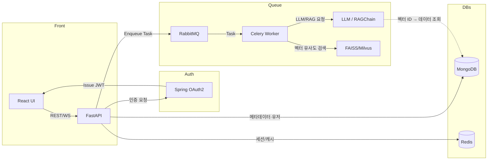

# 1. 프로젝트 개요
- 목표: 사용자의 체질(한의학 기반) 진단 후, 해당 체질에 최적화된 레시피(식단·요리법)를 자동으로 생성하고, 개인화된 식단 관리 및 쇼핑까지 지원하는 통합 플랫폼 구축  
- 주요 특징  
  1. LLM(챗봇)을 통한 체질 진단  
  2. RAG(Retrieval‑Augmented Generation)로 외부 레시피 지식베이스 활용  
  3. 상황별 프리프롬프트 & 모델 교체(MCP)  
  4. LangChain(RAGChain) 기반 파이프라인  
  5. 맞춤형 추천·식단 플래너·장바구니 자동화 등 실생활 밀착 기능  
  6. 자동 크롤링 + AI 생성·평가 시스템  
  7. Agent 기반 레시피 동적 생성  
  8. 최종 모델 양자화(Quantization)  

# 2. 기능 흐름(FLOW)
1. **로그인 & 인증**  
   - OAuth2 / JWT 기반으로 사용자 인증 처리  
2. **체질 진단 챗봇**  
   - FastAPI 백엔드에서 LLM 호출 → 8체질(목양·목음·토양·토음·금양·금음·수양·수음) 분류  
3. **맞춤형 레시피 추천**  
   - 체질·선호 식재료·알러지·이력 기반 개인화 추천  
4. **식단 플래너 & 캘린더 연동**  
   - 일/주/월 단위로 자동 식단을 생성하고, 외부 캘린더(구글, 네이버 등)와 연동  
   - 식단별 영양소, 칼로리 자동 집계   
5. **장바구니/쇼핑리스트 자동 생성**  
   - 추천된 레시피를 기반으로 필요한 재료를 자동으로 추출하여 장바구니 또는 쇼핑리스트 생성  
   - 마트별 가격 비교, 온라인 주문 API 연동 등으로 확장 가능  
6. **레시피 생성(RAG + MCP)**  
   - 체질 결과 + 사용자 선호도 정보를 기반으로 RAG 파이프라인 구동  
   - 레시피 DB(외부 크롤링·API로 구축)에서 유사 레시피 검색  
   - MCP(Model Context Protocol)로 상황별 최적 모델 동적 선택 및 프롬프트 적용  
7. **응답 반환 & 히스토리 저장**  
   - 생성된 레시피·식단·쇼핑리스트를 React UI에 전달 → MongoDB에 저장  
8. **자동 레시피 수집·생성 시스템**  
   8.1 크롤링 파이프라인 → 외부 사이트 주기 크롤링 → MongoDB에 메타데이터 저장  
   8.2 LLM 생성 파이프라인 → Celery 워커가 Prompt 호출 → 임시 '생성 레시피' 저장  
   8.3 LLM 평가 파이프라인 → 논리·영양 평가 Prompt → 기준 이상만 본 DB에 저장  
   8.4 사용자 제출 레시피 평가 → LLM 자동 평가 + 큐레이터 검수 → 저장  
   8.5 피드백·학습 루프 → 사용자 평점·이용 이력 기반 파인튜닝 데이터로 활용  
9. **Agent 기반 레시피 동적 생성**  
   - 내부 검색 실패 시 Agent 트리거 → web_crawl, search_db, llm_generate, llm_refine 도구 조합  
   - 자동 크롤링된 결과 + 기존 레시피로 1차 생성 → 평가 후 본 DB에 저장  
   - UI: 진행 표시·재생성 요청 기능  

# 3. AI 아키텍처

## 3.1 RAG(Retrieval-Augmented Generation)
- **Retrieval 단계**: 레시피 벡터 DB(FAISS or Milvus)에 사용자 체질·키워드 기반 검색  
- **Augmentation**: 검색된 레시피 조각을 프롬프트에 삽입  
- **Generation 단계**: LLM에 프리·포스트 프롬프트 적용  

## 3.2 LangChain & RAGChain
- LangChain을 이용해  
  1. Document Loader → 2. Vector Store → 3. RetrievalQA Chain  
- 필요에 따라 Custom Chain(“체질별 진단 → 레시피 추출 → 커스터마이징 생성”) 구현  

## 3.3 MCP(Model Context Protocol)
- "다이어트용", "면역강화용", "소화개선용" 등 상황별로 컨텍스트를 정의하고, 각 상황에 최적화된 모델을 동적으로 선택(갈아끼우기)하는 프로토콜 설계
- 기능별로 최적화된 프롬프트를 각 모델에 적용하여, 상황과 목적에 맞는 응답을 생성
- MCP를 통해 다양한 LLM 또는 파인튜닝된 모델을 유연하게 교체·조합하여, 성능과 목적에 따라 최적의 결과를 도출

## 3.4 Quantization
- 생성 모델(LLM) 및 파인튜닝된 소형 모델에 대해 8‑bit / 4‑bit 양자화  
- ONNX Runtime + QNNPACK, HuggingFace Compress API 등 활용  

# 4. 웹 기술 스택

| 구분       | 기술            | 역할 및 이유                                          |
|----------|---------------|-----------------------------------------------------|
| Backend  | FastAPI       | 비동기 처리, 경량 REST API, Python 기반 ML 연동 용이            |
|          | Spring (Boot) | 사용자 인증·권한 관리, 안정적인 엔터프라이즈 로직 처리           |
|          | RabbitMQ      | Task 큐잉(RAG 검색, LLM 호출, 비동기 배치 작업)               |
|          | Celery        | RabbitMQ와 연동한 워커, 스케줄링, 재시도 로직 지원               |
| Frontend | React         | 컴포넌트 기반 UI, 상태 관리(Redux/Recoil), 풍부한 생태계            |
| Infra    | Docker        | 컨테이너화, CI/CD 파이프라인 통합                 |

# 5. DB 선택 & 근거

1. **레시피 벡터 저장소**
   - FAISS 또는 Milvus
   - 역할: 레시피 텍스트의 벡터 임베딩만 저장하여 유사도 검색 지원
   - 장점: 고속 유사도 검색, 대규모 벡터 처리 최적화

2. **메타데이터·유저 히스토리 DB**  
   - MongoDB: 스키마리스 문서 지향 → 유연한 레시피/유저 데이터 저장  
   - 역할: 레시피 상세, 사용자 프로필·이력, 생성·평가 메타데이터 저장  

3. **세션·캐시**  
   - Redis: Session, Rate‑limit, Pub/Sub  

# 6. 제안 아키텍처 다이어그램

# 7. 단계별 개발 로드맵
1. 로그인/인증 모듈 + 챗봇 PoC  
2. 벡터 DB 구축(RAGChain) + 기본 레시피 생성  
3. MCP 파이프라인 구현 + 추천/플래너/장바구니 기능 개발  
4. 자동 크롤링·생성·평가 시스템 개발  
5. Agent 기반 동적 생성 시스템 구현  
6. Quantization 및 모델 경량화  
7. UI/UX 고도화 · CI/CD · 모니터링  
