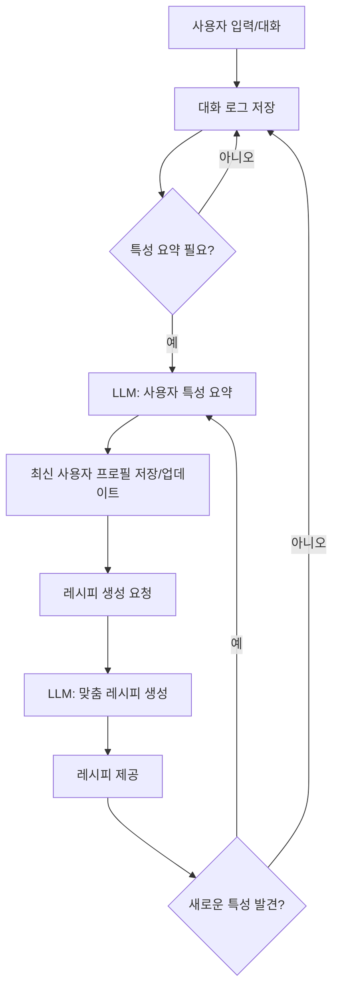

# LLM 기반 사용자 대화 요약 및 맞춤 레시피 생성 아키텍처

## 아키텍처 개요

아래는 사용자의 대화 데이터를 LLM으로 요약하여 프로필을 만들고, 이를 기반으로 맞춤형 레시피를 생성하는 전체 흐름을 최적화한 아키텍처입니다.



---

## 단계별 설명

### 1. 사용자 입력/대화
- 사용자가 챗봇과 자유롭게 대화(취향, 알레르기, 선호/비선호, 최근 관심 등)

### 2. 대화 로그 저장
- 모든 대화 메시지를 세션/사용자별로 저장 (DB, 로그, 클라우드 등)

### 3. 특성 요약 필요 판단
- 레시피 생성 시점, 또는 일정 대화량/새로운 정보 등장 시 LLM 요약 트리거

### 4. LLM을 통한 사용자 특성 요약
- 누적된(또는 최근) 대화를 LLM에 입력하여 취향/특성/기타사항을 구조화된 프로필로 요약
- 예시 프롬프트:
  ```
  아래는 사용자와의 대화입니다. 이 사용자의 음식 취향, 알레르기, 선호/비선호 재료, 기타 특이사항을 표로 정리해줘.
  ---
  {대화 전체}
  ```

### 5. 최신 사용자 프로필 저장/업데이트
- 요약 결과를 DB/캐시 등에 저장, 이후 레시피 생성에 활용

### 6. 레시피 생성 요청
- 사용자가 레시피를 요청하면, 최신 프로필을 LLM 프롬프트에 삽입

### 7. LLM을 통한 맞춤 레시피 생성
- 체질, 취향, 알레르기, 선호/비선호, 기타 특성을 모두 반영한 레시피 생성

### 8. 레시피 제공
- 사용자에게 맞춤 레시피 결과 제공

### 9. 새로운 특성 발견 시 반복
- 대화 중 새로운 취향/상황이 등장하면, 다시 LLM 요약 및 프로필 업데이트 반복

---

## 최적화 포인트 및 추가 고려사항

- **요약 빈도 최적화**: 대화가 너무 길어지면 최근 N턴만 요약, 이전 요약+신규 대화만 요약 등으로 LLM 비용/속도 최적화
- **프로필 캐싱**: 요약 결과를 캐싱하여 불필요한 LLM 호출 최소화
- **프롬프트 엔지니어링**: 요약/레시피 생성 프롬프트를 지속적으로 개선하여 품질 향상
- **사용자 피드백 루프**: 레시피 사용 후 피드백을 받아 프로필/추천에 반영
- **프라이버시/보안**: 사용자 데이터 저장/활용 시 개인정보 보호 및 동의 절차 준수
- **확장성**: 멀티유저, 다양한 레시피 타입, 추가 특성(예: 건강상태, 계절 등)도 쉽게 확장 가능

---

## 결론

이 아키텍처는 LLM의 자연어 이해력과 요약 능력을 적극 활용하여, 사용자의 최신 특성을 반영한 맞춤형 레시피를 지속적으로 제공할 수 있도록 설계되었습니다. 반복적 요약과 프로필 업데이트, 프롬프트 기반 레시피 생성, 피드백 루프까지 모두 포함하여 실제 서비스에 바로 적용 가능한 구조입니다. 