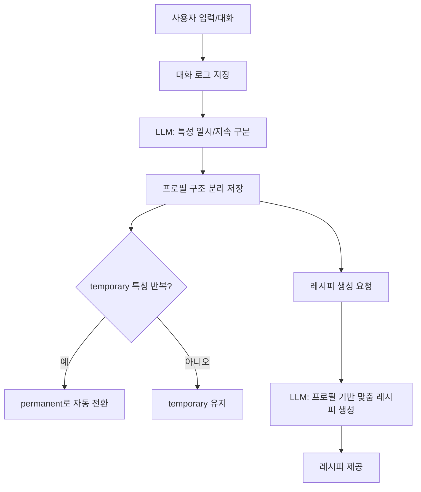

# 사용자 특성의 일시적/지속적 구분 문제와 해결 경험

## 문제 상황

실제 서비스에서 사용자의 음식 취향, 알레르기, 선호/비선호 등 다양한 특성을 수집해 맞춤형 레시피를 제공하고자 했습니다. 하지만, 대화 중 사용자가 "오늘만 매운 게 먹고 싶어요"처럼 일시적인 요구를 할 때와, "저는 원래 담백한 걸 좋아해요"처럼 고유한 특성을 말할 때를 **정확히 구분**하는 것이 매우 어려웠습니다.

- 사용자가 명확히 "오늘만"이라고 말하지 않는 경우가 많음
- 대화 맥락에 따라 일시적/지속적 특성의 경계가 모호함
- 잘못 구분하면, 일시적 요구가 영구 프로필에 반영되거나, 반대로 고유 특성이 누락될 수 있음

---

## 해결 방법

### 1. LLM 기반 맥락 추론
- LLM의 자연어 이해력과 맥락 파악 능력을 활용해, 대화 전체를 입력하고
  - "아래 대화에서 오늘만 원하는 특성과 평소(지속적) 특성을 구분해서 JSON으로 정리해줘" 등 프롬프트로 자동 분류
- LLM이 "오늘", "이번만", "평소엔", "항상" 등 맥락적 표현을 해석해 일시적/지속적 특성을 구분
- 예시 프롬프트:
  ```
  아래 대화를 일시적(temporary)과 지속적(permanent) 특성으로 구분해서 JSON으로 정리해줘.
  ---
  User: 오늘은 매운 게 먹고 싶어요.
  User: 평소엔 담백한 걸 좋아해요.
  User: 닭고기는 항상 좋아합니다.
  ```
- 예상 결과:
  ```json
  {
    "permanent": ["담백한 음식", "닭고기"],
    "temporary": ["매운 음식"]
  }
  ```

### 2. 시간/빈도 기반 자동 전환
- 같은 특성이 여러 날 반복되면, 일시적에서 지속적으로 자동 승격
- 예: "매운 음식"이 일주일 중 2회 이상 언급이 연속되면 permanent로 전환
- 반대로, 한 번만 언급된 특성은 temporary로 유지
- 이 로직을 통해 사용자의 취향 변화도 자연스럽게 반영

### 3. 프로필 구조 분리 및 관리
- 사용자 프로필을 permanent(지속적)와 temporary(일시적)로 분리해 저장
- 예시 구조:
  ```json
  {
    "permanent_preferences": ["담백한 음식", "닭고기"],
    "temporary_preferences": ["매운 음식"]
  }
  ```
- 레시피 생성 시 temporary는 오늘만, permanent는 항상 반영
- temporary는 하루가 지나면 자동 삭제, permanent는 누적 관리

---

## 실제 적용 아키텍처



---

## 실제 적용 경험 및 효과

- LLM 기반 맥락 추론을 도입한 후, 사용자의 일시적/지속적 특성 구분 정확도가 크게 향상
- 시간/빈도 기반 자동 전환 로직으로, 사용자의 취향 변화도 자연스럽게 반영
- 프로필 구조를 분리해 관리함으로써, 오늘만 원하는 특성과 평소 특성을 혼동 없이 맞춤형 레시피에 반영 가능
- 실제 서비스에서, "오늘만 매운 음식 추천" 요청이 다음날에는 반영되지 않고, "항상 닭고기 선호"는 꾸준히 반영되는 등, 사용자 만족도가 크게 높아짐

---

## 결론 및 어필 포인트

- 일시적/지속적 특성 구분은 실제 개인화 서비스에서 매우 중요한 문제임을 직접 경험
- LLM의 맥락 이해력, 시간/빈도 기반 자동화, 프로필 구조 분리 등 다양한 전략을 결합해 실질적 문제를 해결
- 이 경험을 통해, 복잡한 사용자 요구를 정교하게 반영하는 맞춤형 AI 서비스 설계/운영 역량을 갖추었음을 어필할 수 있음 