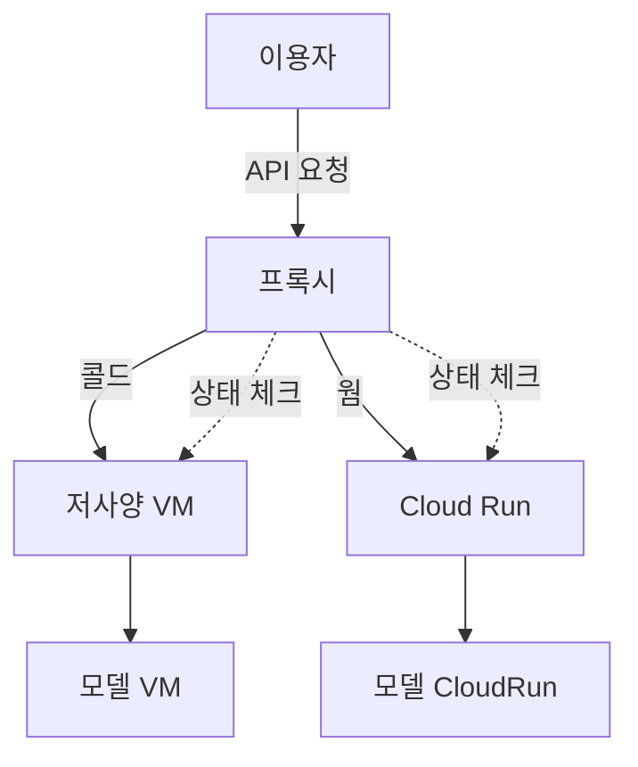

# GCP 모델 인퍼런스 하이브리드 아키텍처 제안 및 경험 공유

## 1. 배경 및 문제 상황
- **서버리스(Cloud Run 등) 기반 모델 인퍼런스**는 트래픽에 따라 자동 확장되고 관리가 편리하지만, 첫 요청 시 **콜드 스타트(기동 지연)** 문제가 발생할 수 있음
- 실제 서비스에서 사용자가 처음 요청할 때 수 초 이상 지연이 발생해 UX가 저하되는 경험이 있었음
- **항상 켜져 있는 서버(Compute Engine VM 등)**는 콜드 스타트가 없지만, 트래픽이 적을 때도 비용이 지속적으로 발생함

---

## 2. 하이브리드 아키텍처 제안
- **저사양 VM(Compute Engine) + Cloud Run(서버리스) 조합**
- 기본/저용량 트래픽은 항상 켜져 있는 VM에서 처리 → 빠른 응답
- 트래픽 급증, 대용량 인퍼런스 요청은 Cloud Run으로 자동 확장
- 로드밸런서/프록시(Nginx, GCP Load Balancer 등)로 요청 분산

---

## 3. 콜드 스타트 상황별 요청 처리 전략
- **Cloud Run이 콜드(기동 전/슬립 상태)일 때**
    - 모든 인퍼런스 요청을 VM에서 우선 처리
    - VM이 처리 가능한 최대치까지 빠르게 응답
    - Cloud Run 인스턴스가 기동될 때까지 대기/큐잉
- **Cloud Run이 웜(기동 완료/활성 상태)일 때**
    - 트래픽의 대부분을 Cloud Run으로 분산
    - VM은 백업/저부하 처리만 담당
- **프록시/로드밸런서에서 상태 감지**
    - Cloud Run의 상태(응답 속도, 헬스체크 등) 기반으로 분기
    - 예: Cloud Run 응답 지연 시 자동으로 VM으로 우회

---

## 4. 아키텍처 다이어그램

- **설명:**
    - 프록시가 Cloud Run의 상태(콜드/웜)를 실시간으로 체크
    - 콜드 상태면 VM으로, 웜 상태면 Cloud Run으로 요청을 분기
    - 각 인퍼런스 서버는 동일한 모델을 구동

---

## 5. 장점
- 콜드 스타트 문제 최소화(항상 켜진 VM이 빠른 응답)
- Cloud Run이 활성화되면 대용량 트래픽도 자동 확장
- 비용/성능 균형

## 6. 단점 및 고려사항
- 아키텍처 복잡도 증가(프록시/분산 로직 필요)
- VM 관리 필요(보안, 패치 등)
- Cloud Run 상태 감지 및 트래픽 분산 로직 설계 필요

---

## 7. 실전 적용 팁
- **Cloud Run Always On 옵션**: 콜드 스타트 완화에 도움, 하지만 비용 증가
- **VM은 저사양으로 최소화**: 트래픽 예측해 스펙 결정, 필요시 오토스케일링
- **프록시 로직**: Cloud Run 상태(헬스체크, 응답 속도 등) 기반으로 동적 분기
- **모니터링**: GCP Monitoring, Logging 적극 활용
- **콜드 스타트 감지**: Cloud Run의 첫 응답 지연을 기준으로 자동 우회 구현

---

## 8. 결론
- 서버리스의 편리함과 VM의 빠른 응답을 결합해, 실제 서비스에서 콜드 스타트 문제를 효과적으로 해결할 수 있었음
- 트래픽 패턴과 Cloud Run 상태에 따라 하이브리드 구조를 적극 고려해볼 것

---

## 9. 참고
- [Cloud Run 콜드 스타트 공식 문서](https://cloud.google.com/run/docs/container-contract#instance-lifecycle)
- [GCP Compute Engine](https://cloud.google.com/compute)
- [GCP Load Balancing](https://cloud.google.com/load-balancing) 