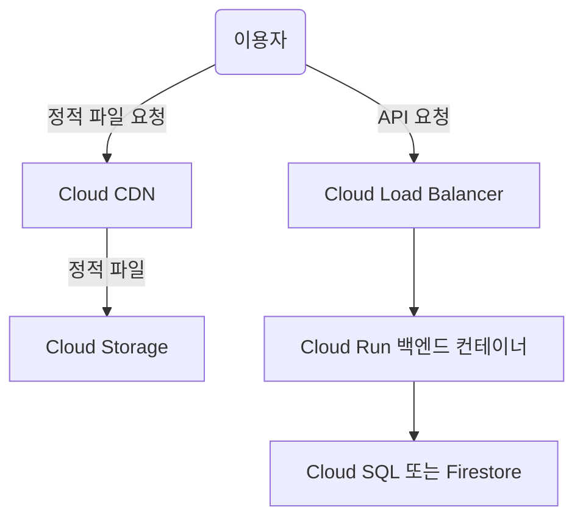

# GCP 웹 서비스(백엔드+프론트엔드) 서버 추천 및 비용 예측

## 1. 서비스 시나리오 및 요구사항
- **이용자 수**: 시간당 1000명(동시 접속자 50~100명 가정)
- **구성**: 백엔드(REST API), 프론트엔드(정적 웹/SPA)
- **특징**: 실시간성이 높지 않고, 일반적인 CRUD/조회 위주 서비스
- **확장성**: 추후 트래픽 증가 가능성 고려

---

## 2. GCP 서버 추천

### 2-1. 프론트엔드(정적 웹/SPA)
- **Cloud Storage + Cloud CDN**
  - 정적 파일(HTML, JS, CSS, 이미지 등)은 Cloud Storage에 저장, Cloud CDN으로 전 세계 빠른 배포
  - 서버 관리 필요 없음, 트래픽 증가에도 자동 확장
  - **비용 효율적**

### 2-2. 백엔드(REST API)
- **Compute Engine(가상머신) 또는 Cloud Run(서버리스 컨테이너)**
  - **Compute Engine**: VM 직접 운영, 커스텀 환경/고정 트래픽에 적합
  - **Cloud Run**: 컨테이너 기반 서버리스, 트래픽에 따라 자동 확장, 관리 부담 적음
  - **추천**: Cloud Run (초기에는 관리가 편하고, 트래픽 증가 시 자동 확장)

#### Cloud Run 권장 스펙 예시
- **vCPU 2개, 메모리 4GB** 컨테이너 2~3개(동시성 80~100)
- 시간당 1000명 수준이면 Cloud Run 기본 요금제(Always On 옵션 불필요)

---

## 3. 서버 선택 이유
- **Cloud Storage + CDN**: 정적 파일 서비스에 최적, 서버 관리 불필요, 저렴함
- **Cloud Run**: 트래픽에 따라 자동 확장, 서버 관리 부담 최소화, 초기 스타트업/중소 서비스에 적합
- **Compute Engine**: 커스텀 환경, 장기적 고정 트래픽이면 고려(초기에는 Cloud Run이 더 효율적)

---

## 4. 비용 예측(2024년 기준)

### 4-1. 프론트엔드(Cloud Storage + CDN)
- **Cloud Storage**: 월 10GB 저장, 월 100GB 전송 기준 → 약 $0.5~$2/월
- **Cloud CDN**: 월 100GB~1TB 전송 기준 → $8~$80/월(아시아 기준, 1GB당 $0.08)

### 4-2. 백엔드(Cloud Run)
- **Cloud Run**: vCPU 2개, 메모리 4GB, 월 50시간 사용(트래픽에 따라 자동 확장)
  - 월 50시간 x 2vCPU x $0.000024/vCPU-초 ≈ $8.64
  - 메모리 4GB x 50시간 x $0.0000025/MB-초 ≈ $1.8
  - **합계**: 약 $10~$20/월(트래픽에 따라 변동, 무료 할당량 일부 포함)

### 4-3. Compute Engine(참고)
- n1-standard-2(2vCPU, 7.5GB RAM) 기준: 약 $50/월(서울 리전)
- n1-standard-4(4vCPU, 15GB RAM) 기준: 약 $100/월(서울 리전)

### 4-4. 총합(예상)
- **Cloud Run + Cloud Storage + CDN**: 약 $20~$100/월(트래픽/사용량에 따라 변동)
- **Compute Engine 사용 시**: 약 $60~$120/월(트래픽 별도)

---

## 5. 아키텍처 다이어그램

---

## 6. 결론 및 추천
- **초기/중소 서비스**: Cloud Run + Cloud Storage + CDN 조합이 관리 부담 적고, 비용 효율적이며, 트래픽 증가 시 자동 확장 가능
- **트래픽이 매우 크거나, 커스텀 환경 필요**: Compute Engine 고려
- **비용**: 월 $20~$100 수준에서 시작 가능(트래픽/사용량에 따라 변동)

---

## 7. 참고
- [GCP 공식 가격 계산기](https://cloud.google.com/products/calculator?hl=ko)
- [Cloud Run 가격](https://cloud.google.com/run/pricing?hl=ko)
- [Cloud Storage 가격](https://cloud.google.com/storage/pricing?hl=ko)
- [Cloud CDN 가격](https://cloud.google.com/cdn/pricing?hl=ko)

---

### 문의/상담 필요시 GCP 공식 지원 또는 파트너사에 문의 권장 